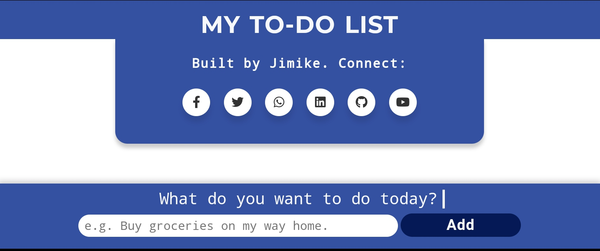
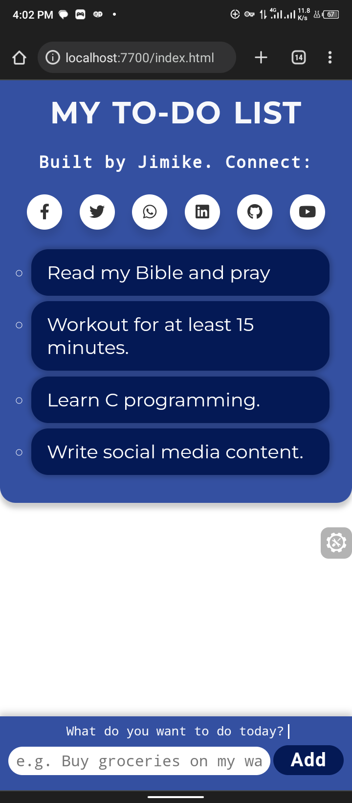
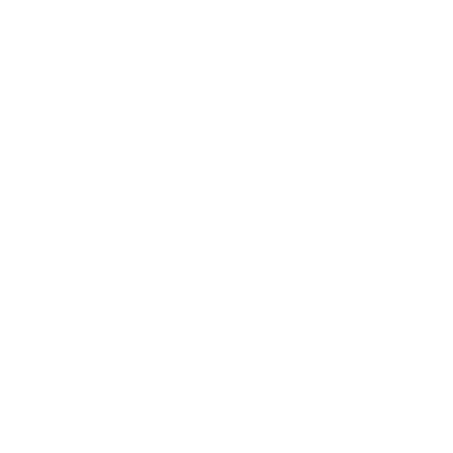

# To-do List App 
> A simple to-do list application created using HTML 5, CSS 3 and JavaScript.
> Live demo [_here_](https://jimike110.ml/todoApp).

## Table of Contents
* [General Info](#general-information)
* [Technologies Used](#technologies-used)
* [Features](#features)
* [Screenshots](#screenshots)
* [Setup](#setup)
* [Usage](#usage)
* [Project Status](#project-status)
* [To-do](#to-do)
* [Acknowledgements](#acknowledgements)
* [Contact](#contact)

## General Information
- This project is a simple to-do list application created using HTML 5, CSS 3, and JavaScript. It allows users input tasks, delete tasks and automatically saves page state accordingly.
- This project was built to exercise my knowledge of HTML 5, CSS 3 and JavaScript.

## Technologies Used
- HTML 5
- CSS 3
- JavaScript

## Features
- Add task to list
- Delete task from list
- Save page state even on page reload
- Show alert message on a blank or whitespace only input
- Fully responsive to fit all device widths 

## Screenshots

Desktop View

Mobile View

## Usage
The To-do List App being web-based, simply requires a web browser to run. To use, navigate to [_https://jimike110.ml/todoApp_](https://jimike110.ml/todoApp).

## Project Status
The To-do List App is complete and functional, but there is room for additional features to be added in the future.

## To-do
- Scale this up to a real mobile application
- Option to edit task
- Option to add due dates to tasks
- Option to categorize tasks
- Option to mark tasks as complete 

## Acknowledgements
This project was created as a personal learning project to improve my skills in HTML 5, CSS 3, and JavaScript.
- This project was inspired by a similar project by [@dev_maims](https://twitter.com/dev_maims)

## Contact
Created by [Jimike](https://jimike110.ml/). For any question or feedback, feel free to contact me &hearts; [oladoyemike@gmail.com](mailto:oladoyemike@gmail.com)
Twitter: [@jimikeCodes](https://Twitter.com/jimikeCodes/)

